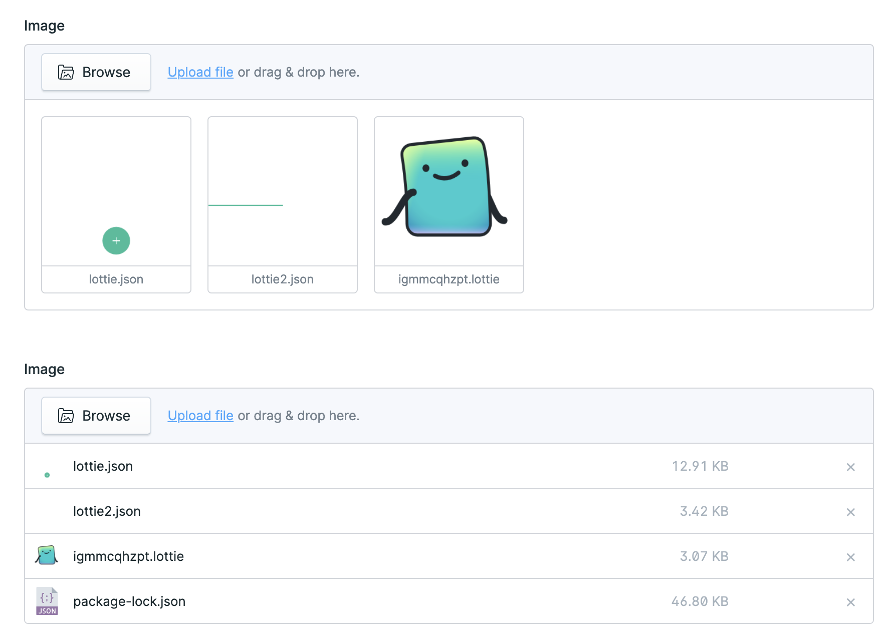

# Statamic Lottie Preview

> A Statamic addon that previews Lottie animations in your control panel.



## Features

Support for `.lottie` and `.json` files

## How to Install

You can install this addon via Composer:

``` bash
composer require el-schneider/statamic-lottie-preview
```

## Roadmap

- [ ] Add assets browser support
- [ ] Full playback controls for editor view
